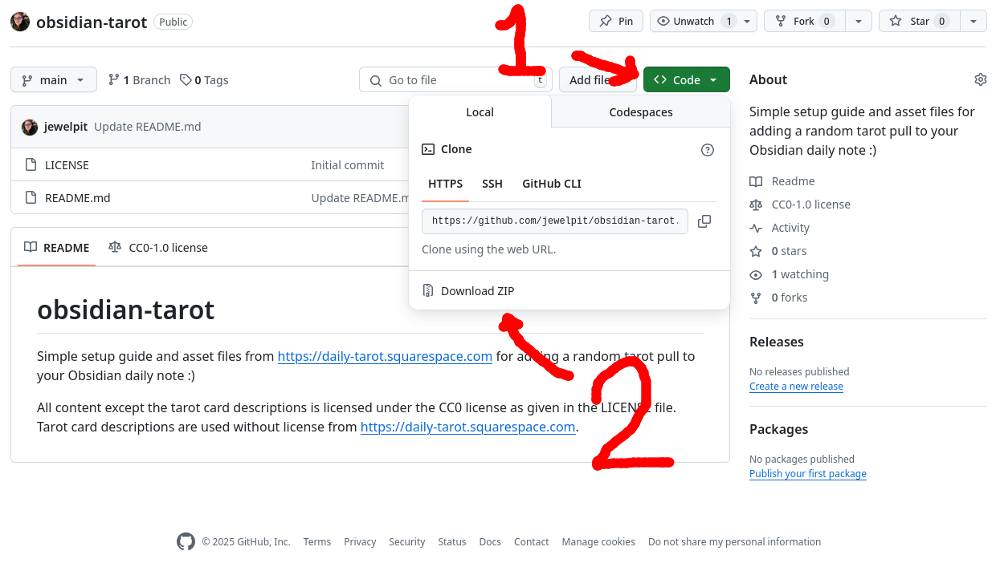
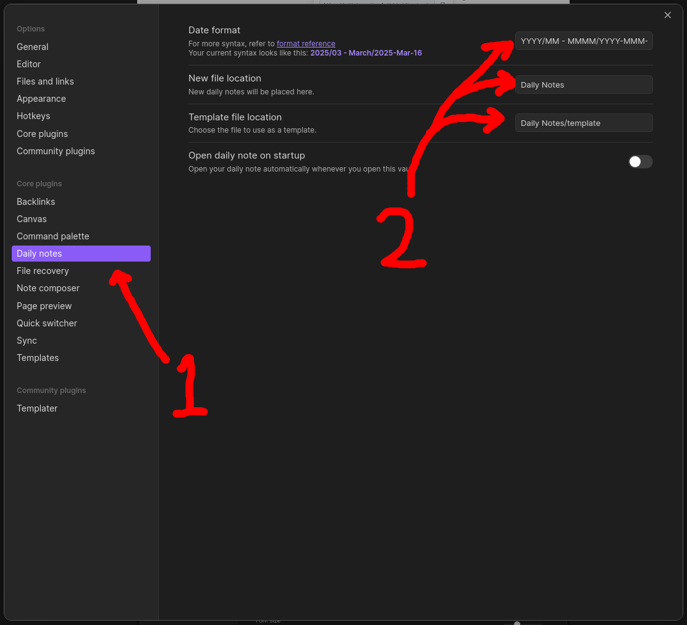
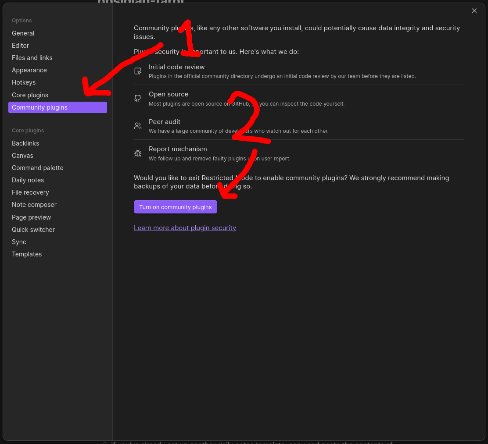
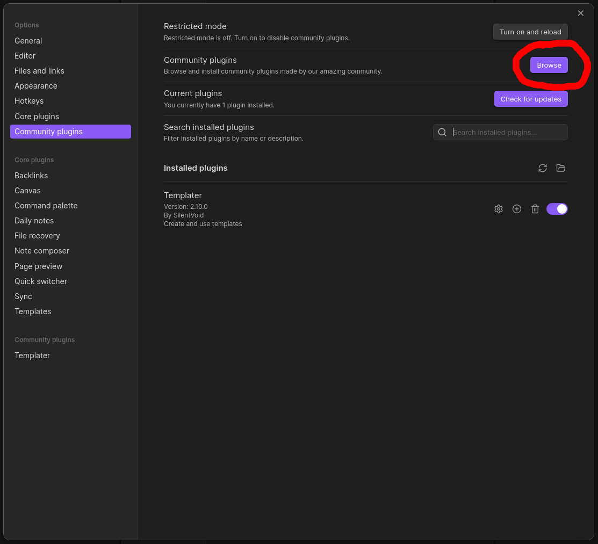
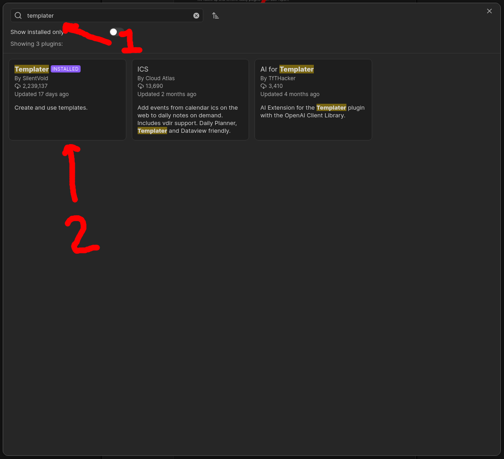
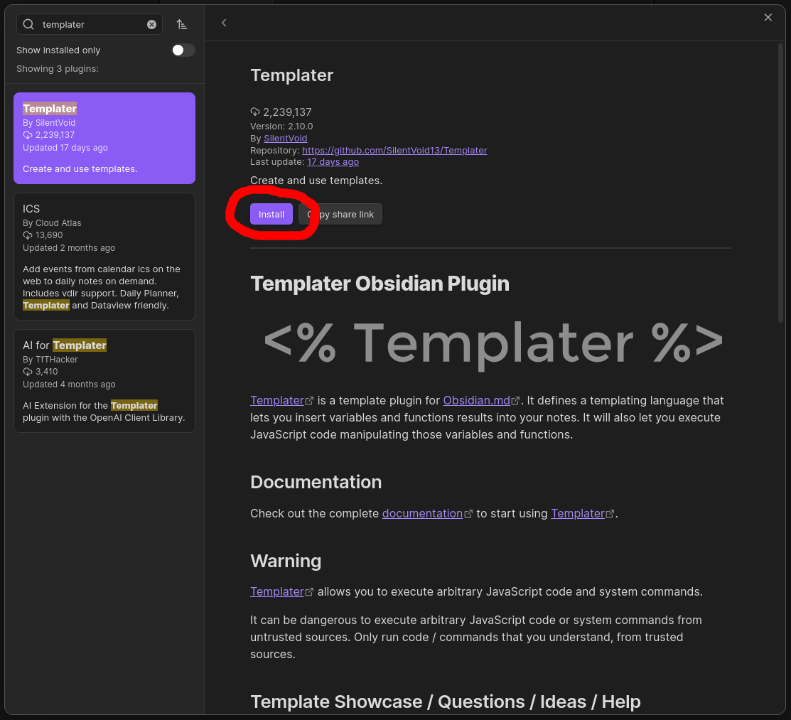
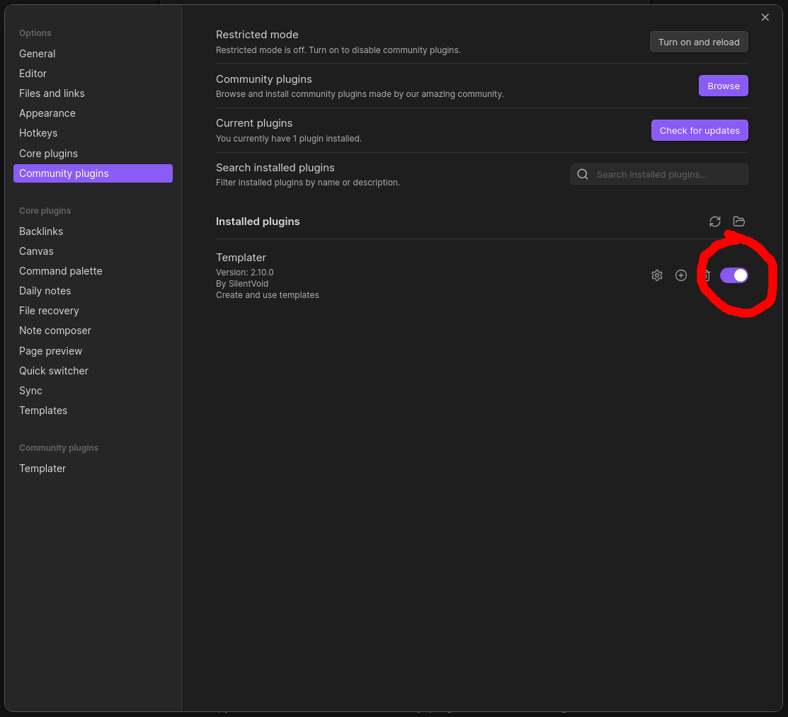
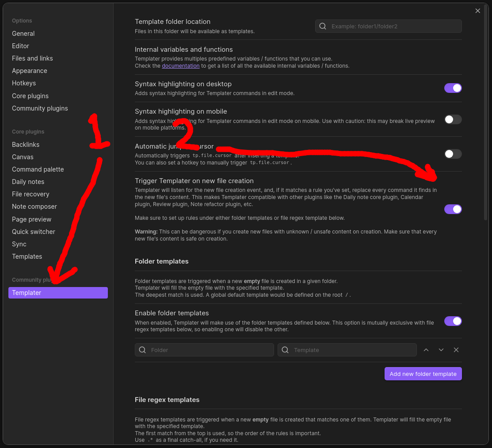
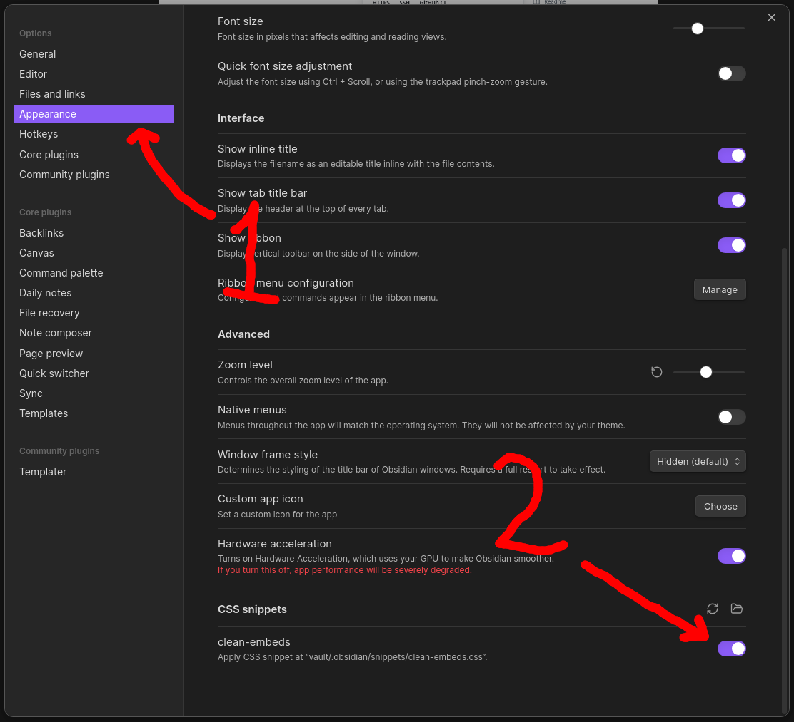
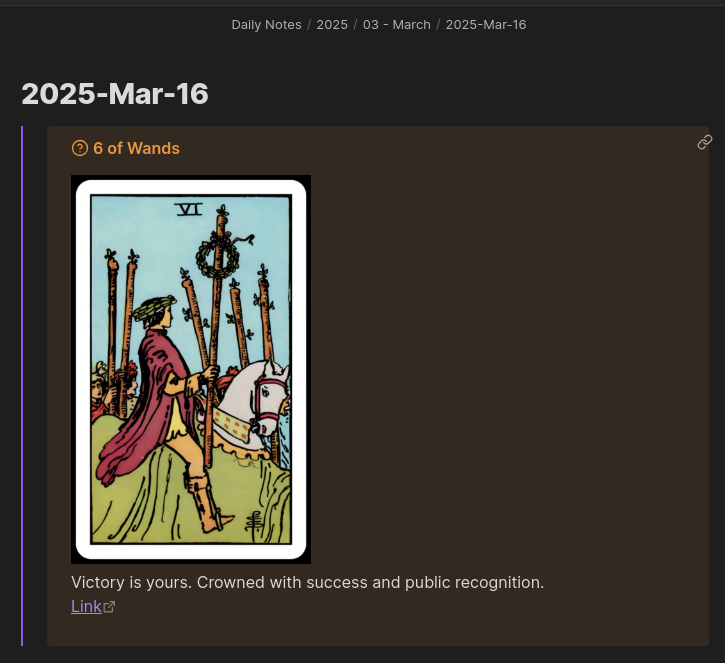

# obsidian-tarot
Simple setup guide and asset files from https://daily-tarot.squarespace.com for adding a random tarot pull to your Obsidian daily note :)

All content except the tarot card descriptions is licensed under the CC0 license as given in the LICENSE file. Tarot card descriptions are used without license from https://daily-tarot.squarespace.com.

# Setup
To add this to your Obsidian vault, do the following:

## 1. Download the files
Go to [the GitHub repo](https://github.com/jewelpit/obsidian-tarot), then click the bright green `<> Code` button, and select `Download ZIP` in the popup menu.

## 2. Unzip the files and copy them over
Unzip the downloaded ZIP archive in your ZIP reader of choice, then copy the following files into your Obsidian vault:

1. Copy the `Daily Notes/_attachments` and `Daily Notes/Tarot` folders under your own daily notes folder, or a new `Daily Notes` folder if you haven't already set one up.
2. If you've already set up another daily notes template, copy and paste the _contents_ of `Daily Notes/template.md` into it. If you don't already have a daily notes template, copy the `template.md` _file_ into your daily notes folder.
3. Optional: copy `.obsidian/snippets/clean-embeds.css` file under your `.obsidian/snippets` folder.
	1. You might need to enable your computer's "view hidden files" setting to see the `.obsidian` folder in your file browser.
	2. You might need to make your vault's `.obsidian/snippets` folder if it doesn't already exist.
	3. This step is optional, but it makes the embeds look better.

## 3. Configure your daily notes plugin
If you already have your daily notes set up with templates _and_ you've already copied the `template.md` content from this vault to your own template file, you can skip this section.

However, if you haven't already done so, set up your daily notes template now. At the very least, you'll need to set up the template, and it's a good idea to set a folder too (I like to further break my folders down by year and month).

Go into your settings menu, click on the `Daily notes` tab in the sidebar, then update your date format, new file location, and template file location settings:

It's cut off in the screenshot, but the `Date format` value I'm using is `YYYY/MM - MMMM/YYYY-MMM-DD`. This'll organize them into folders by year and month. I don't know if it's intentional to be able to put folder names in here, though, so that functionality might stop working in the future.

## 4. Install and configure Templater
### 4.1. Installing Templater
If you haven't already enabled any community plugins, you'll have to do that now. Go into your settings, click on the `Community plugins` tab in the sidebar, then click the `Turn on community plugins` button.

Once that's done, or if you've already enabled community plugins in the past, click the `Browse` button in your `Community plugins` tab and install Templater.

When Obsidian asks you to enable to the plugin, do so now. If you accidentally cancel out of that screen, you can still do it from the `Community plugins` tab in the settings window:

### 4.2. Configuring Templater
In order for Templater to inject the embed in your daily note when you create it, it has to be enabled for triggering on new file creation. Click on the `Templater` tab in the settings sidebar, then toggle `Trigger Templater on new file creation` to on.

## 5. Enable the optional CSS snippet
Open your Obsidian settings from inside the app, click on the `Appearance` tab in the sidebar, then scroll to the bottom and toggle the `clean-embeds` CSS snippet on:

This will hide the page name from the embed, making it look a little cleaner.

## 6. You're done!
Let's make a new daily note to test:

Nice.